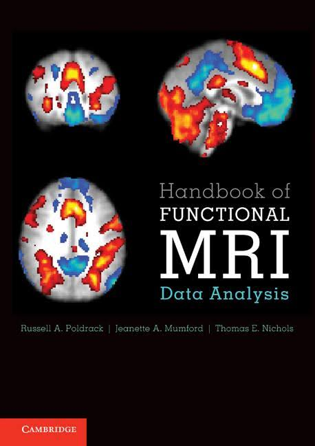

# Books

As the course is based around SPM, it could be a good idea to have a look at the SPM book :

* [Human brain function](https://www.fil.ion.ucl.ac.uk/spm/doc/books/hbf2/) edited John Ashburner, Karl Friston, Will Penny (the second edition is freely available on-line).
---
But it can get pretty quickly technical and could easily put off people with a math aversion. So I can recommend two other books.

* [Handbook of Functional MRI Data Analysis](https://www.cambridge.org/core/books/handbook-of-functional-mri-data-analysis/8EDF966C65811FCCC306F7C916228529) by Russell A. Poldrack, Jeanette A. Mumford and Thomas E. Nichols

What this book lacks in mathematical depth, it makes up for in breadth and conceptual clarity.

This book also has an unofficial companion [youtube channel](https://www.youtube.com/channel/UCZ7gF0zm35FwrFpDND6DWeA). where Jeanette A. Mumford has a fantastic series of videos on neuroimaging analysis: I highly recommend it. The channel also has [facebook group](https://www.facebook.com/groups/mumfordbrainstats/) (as well as a [tumblr](http://mumfordbrainstats.tumblr.com/) and [twitter account](https://twitter.com/mumbrainstats) ) if you have questions.

* [Statistical Analysis of fMRI Data]() by F. Gregory Ashby

This one covers fewer topics, the essential actually (preprocessing, GLM, multiple comparison problem, group analysis) but goes into more details, with some maths and examples or matlab code.
