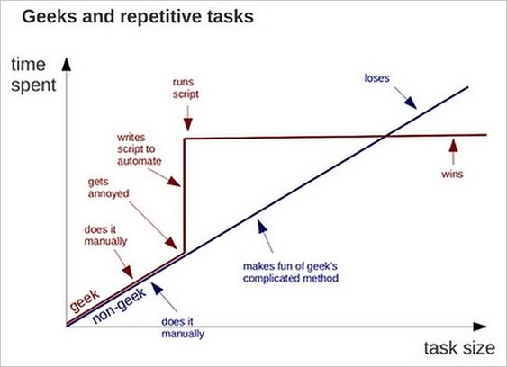

# How to script with SPM

## Why use scripts?

Scripting your preprocessing and your analyis is a good way to [save time](https://external-preview.redd.it/xGS3CBRs2u3ujufXLZS6oCbB-9cCAFy_xuWxOFSjD4c.png?auto=webp&s=9a14526bbd5503dee65554baca74faa0b5681a64), improve reproducibility and avoid human errors. 

But remember that it can also be a pretty efficient way to get some systematic errors that are [hard to track down](http://xkcd.com/1319/).

## How do I know which matlab function performs a given SPM process?

That is in my opinion one of the bigget problem of SPM: the light documentation makes it really difficult to understand how SPM works and most attemtps to do it feel like reverse engineering by parsing a jungle of code... That being said...

Check [here](http://en.wikibooks.org/wiki/SPM/Programming_intro) to start but in general, if you are looking for which SPM function does task X, click on the `help` button in the main SPM menu window, then on the task X (e.g Results): the new window will tell you the name of the function that performs the task you are interested in (`spm_results_ui.m` in this case). 

Another tip is that usually when you run a given process in SPM, the matlab command line will display the main function called. For example clicking on the `Check Reg` button and selecting an image to view display:

`SPM12: spm_check_registration (v6245)              13:42:08 - 30/10/2018`
`========================================================================`
`Display D:\Dropbox\Code\MATLAB\Neuroimaging\SPM\spm12\canonical\avg305T1.nii,1`

This tells you that this called the `spm_check_registration.m` matlab function.

You can also find other interesting suggestions in this discussion of the SPM mailing list: [SPM: Peeking under the hood -- how?](https://www.jiscmail.ac.uk/cgi-bin/webadmin?A2=ind1803&L=spm&P=R58295&1=spm&9=A&J=on&d=No+Match%3BMatch%3BMatches&z=4).

Once you have identified the you can then type either type `help function_name` if you want some more information about this function or `edit function_name` if you want to see the code and figure out how the function works. In either case, do not save any of the changes you are doing to the function and make sure you have enough coffee and patience to understand a lot of lines of code !

If you want to start tweaking SPM functions I recommend that:
1. you version control what you are doing using [GIT](https://git-scm.com/)
1. you save a copy of that file in a completely different folder from its original SPM folder
1. you add that folder to the matlab path above the spm folder and subfolders
1. you start playing around on that copy of the file. 

## How to actually write SPM scripts?

It is usually easier to start creating batches via the graphic interface. Many ressources are available on-line to help you getting started writing your own batch with SPM, see for example [here](http://en.wikibooks.org/w/index.php?title=SPM/Batch&stable=0). SPM also has a `batches` folder that contains examples that can be interesting. Once you have created a batch, save it using `File --> Save batch and script`. This will create a matlab .m file that you can start using to build your own scripts.

In the `How2SCript` folder are 2 matlab .m files that show you what typical SPM scripts look like. I have commented those files to give more explanations and advices, but if something is unclear or does not work, let me know.

1. `Realign_batch.m`

This script runs the preprocessing "realign and write" function from SPM. It uses the raw EPI files from the block design data set from the SPM [website](ftp://ftp.fil.ion.ucl.ac.uk/spm/data/MoAEpilot/MoAEpilot.zip). Unzip the file in a folder, put this script in the same folder and it should run.

2. `First_Level_Design_and_Estimate_batch.m`

This scripts shows how to specify a design for a first-level (subject level) analysis. It uses the raw EPI files from the [event related design data set](ftp://ftp.fil.ion.ucl.ac.uk/spm/data/SPM00AdvEFMRI) from the SPM website with [the "all-conditions.mat" file](http://www.fil.ion.ucl.ac.uk/spm/data/face_rep/) of the same data set. Preprocess the images (see the chapter 29 of the SPM manual) and then put the preprocessed images and the realignment parameters "rp*.txt" in a folder called "EPI". Put this script, the "all-conditions.mat" in the parent directory of this "EPI" folder and it should run.